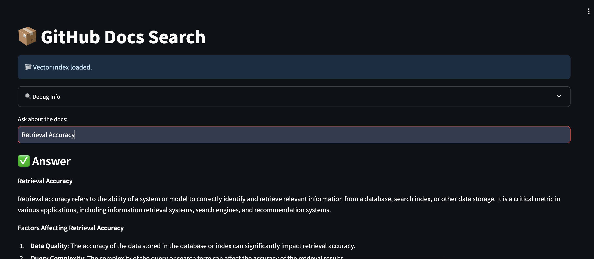

# 📦 GitHub Docs RAG

A production-ready **Retrieval-Augmented Generation (RAG)** application that answers technical questions using repository documentation. Built with modern AI infrastructure, deployed on Hugging Face Spaces, and optimized for accuracy, citations, and zero-cost operation.

 **Live Demo:** https://huggingface.co/spaces/ashiquzzaman/github-docs-rag

 ## 📸 Preview



---

## 🚀 Overview

This project demonstrates a full-stack RAG pipeline that ingests markdown documentation, converts it into searchable vector embeddings, retrieves contextually relevant chunks, and generates grounded LLM responses with exact source citations. Ideal for developer docs, internal knowledge bases, or project wikis.

### ✨ Key Features
- 🔍 Semantic search across `.md` documentation files
-  Grounded LLM answers with strict context adherence
- 📖 Automatic source citations & chunk transparency
- ☁️ 100% free cloud deployment (no credit card required)
- 🧪 Debug-friendly architecture with real-time retrieval visibility

---

## 🛠️ Tech Stack & Tools

| Component | Tool / Library | Purpose |
|-----------|----------------|---------|
| **LLM** | `Groq` (Llama-3.1-8B-Instant) | Fast, instruction-tuned response generation |
| **Embeddings** | `all-MiniLM-L6-v2` (Sentence Transformers) | 384-dim semantic vector encoding |
| **Vector DB** | `Pinecone Serverless` | Cosine similarity search, HNSW indexing |
| **RAG Framework** | `LangChain 0.2.16` | Chunking, retrieval chains, prompt templating |
| **UI** | `Streamlit 1.37.0` | Interactive web interface |
| **Hosting** | `Hugging Face Spaces` | Free GPU/CPU hosting, auto-sync from GitHub |
| **Language** | `Python 3.10` | Core application logic |

---

##  AI Skills Applied & How They're Used

| Skill | Implementation |
|-------|----------------|
| **Retrieval-Augmented Generation** | Combines vector retrieval with LLM generation to ground answers in actual docs, drastically reducing hallucinations. |
| **Embeddings & Semantic Search** | Converts text chunks into dense vectors using `all-MiniLM-L6-v2`. User queries are embedded and matched via cosine similarity in Pinecone. |
| **Chunking Strategies** | Uses `RecursiveCharacterTextSplitter` (`chunk_size=500`, `overlap=50`) to preserve markdown structure, code blocks, and context boundaries. |
| **Relevance Scoring** | Retrieves top-`k=5` results using cosine distance. Metadata filtering & score thresholds can be added for precision tuning. |
| **Citation Generation** | Extracts `source` paths from retrieved `Document` objects and renders them alongside answers for auditability. |
| **Prompt Engineering** | Constrained system prompt (`Answer strictly using the context...`) enforces grounding, fallback behavior, and consistent tone. |

---

## 📐 How to Maintain RAG Quality

RAG systems degrade if not actively maintained. Use these pillars to keep performance high:

### 1. 📊 Evaluate Continuously
- Track **precision@k**, **recall@k**, and **hallucination rate**
- Use frameworks like `Ragas` or `TruLens` for automated scoring
- Manually review 10% of queries weekly for drift

### 2. 🔪 Optimize Chunking
- Adjust `chunk_size` (300–800) based on doc structure
- Use `overlap=10–20%` to preserve cross-chunk context
- Add semantic or markdown-aware splitters for complex docs

### 3. 🔀 Upgrade Retrieval
- Add **hybrid search**: `BM25Retriever` + `VectorRetriever` via `EnsembleRetriever`
- Filter by metadata (`version`, `language`, `section`) to narrow search scope
- Increase `k` or add re-ranking (`Cohere Rerank`, `FlashRank`) for precision

### 4. 🧪 Refine Prompts & LLM Behavior
- Lower `temperature` (0.1–0.3) for factual consistency
- Add few-shot examples for complex query patterns
- Explicit fallback: `"Not found in docs. Try rephrasing or check [link]."`

### 5. 🔄 Refresh & Automate
- Rebuild index when docs change: delete Pinecone index → push new `target_docs/` → HF auto-rebuilds
- Automate sync with GitHub Actions or cron jobs
- Log queries, retrieved chunks, and outputs for audit trails

---

## 🔍 Under the Hood: Chunking, Tokenization & Vectorization

### 📄 1. Chunking Strategy
- **Algorithm:** `RecursiveCharacterTextSplitter` (LangChain)
- **Parameters:** `chunk_size=500`, `chunk_overlap=50`
- **Logic:** Splits documents hierarchically: first by markdown headers (`#`, `##`), then by paragraph breaks (`\n\n`), then by sentences, and finally by characters.
- **Why this works:** Preserves logical boundaries (code blocks, API references, step-by-step guides) while ensuring no semantic context is lost at chunk boundaries. The 50-token overlap guarantees that split sentences maintain continuity during retrieval.

### 🔤 2. Tokenization
- **Engine:** `bert-base-uncased` tokenizer (WordPiece) embedded in `sentence-transformers`
- **Process:** Each chunk is automatically split into subword tokens. The model caps sequences at **256 tokens per chunk**.
- **Optimization:** Chunks under 50 tokens are filtered out to avoid noise. No manual token counting is required—the embedding pipeline handles this transparently during inference.

###  3. Vectorization (Embeddings)
- **Model:** `sentence-transformers/all-MiniLM-L6-v2`
- **Output:** 384-dimensional dense vectors per chunk
- **Mechanism:** Tokenized chunks pass through a 6-layer transformer. The `[CLS]` token representation is L2-normalized to unit length, producing semantically rich vectors where cosine distance directly reflects semantic similarity.
- **Storage:** Vectors are stored in **Pinecone Serverless** with `cosine` similarity metric. Retrieval uses approximate nearest neighbor (ANN) search via HNSW indexing for sub-millisecond latency.

---

##  Quick Deploy

1. **Fork this repo** or clone locally
2. **Set HF Space Secrets** (Settings → Repository secrets):
3. **Deploy to Hugging Face Spaces**:
- SDK: `Streamlit`
- Connect GitHub repo → Enable auto-sync
- Factory Rebuild after first push
4. **Update Docs**: Add `.md` files to `target_docs/` → Push → Space rebuilds automatically

---


###  Option 1: Use the Live Demo (No Setup Required)
1. Visit: https://huggingface.co/spaces/ashiquzzaman/github-docs-rag
2. Type a question about the documentation (e.g., `"How do I configure settings?"`)
3. View the AI-generated answer with exact source file citations
4. Expand the **"Retrieved Context"** section to see the raw chunks used for grounding

###  Option 2: Run Locally (Full Control)
**Prerequisites:**
- Python 3.10+
- Free API keys from [Pinecone](https://app.pinecone.io) & [Groq](https://console.groq.com)
- Git

**Step-by-Step:**
```bash
# 1. Clone & Setup
git clone https://github.com/ashiquzzaman/github-docs-rag.git
cd github-docs-rag
pip install -r requirements.txt

# 2. Prepare Documentation
mkdir -p target_docs
# Add your .md files here, or clone a repo:
# git clone --depth 1 https://github.com/example/docs.git target_docs

# 3. Set Environment Variables
export PINECONE_API_KEY="pcsk_..."
export GROQ_API_KEY="gsk_..."

# 4. Run App
streamlit run app.py

##  License

MIT License. Free to use, modify, and deploy for personal or commercial projects.

---

> 💡 **Built for learning, optimized for production.** Questions or improvements? Open an issue or PR!
